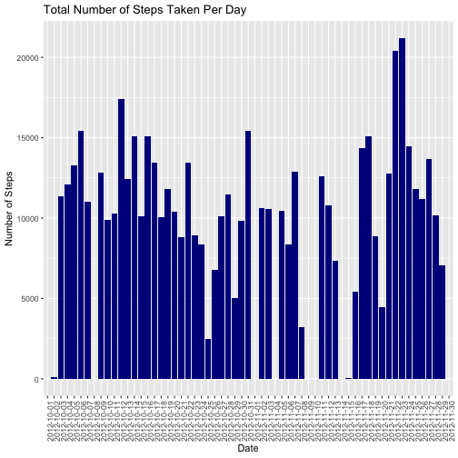
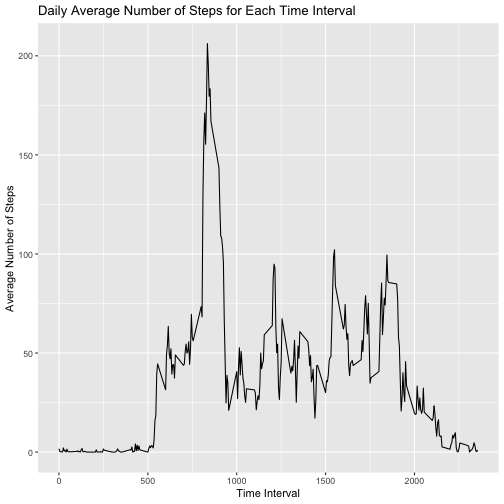
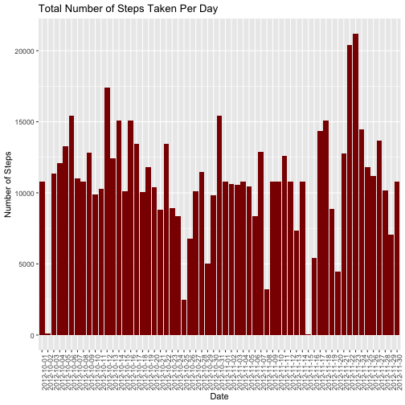
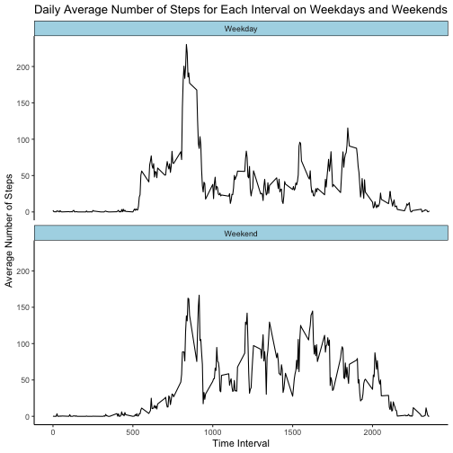

``` r
library(tidyverse)
data <- read.csv("activity.csv")
```
### Question 1. What is the mean total number of steps taken per day?


``` r
# 1. Calculate the total number of steps taken per day.
    total_steps <- data %>% 
      group_by(date) %>% 
     summarise(total.steps = sum(steps, na.rm = TRUE))

# 2. Make a histogram of the total number of steps taken each day.
    ggplot(total_steps, aes(x = date, y = total.steps)) +
      geom_histogram(stat = "identity", fill = "darkblue") +
      theme(axis.text.x = element_text(angle=90,hjust = 1)) +
      labs(title = "Total Number of Steps Taken Per Day",
           x = "Date",
           y = "Number of Steps")
```



``` r
# 3. Calculate and report the mean and median of the total number of steps taken per day.
    total_steps %>% 
      summarise(Mean = mean(total.steps, na.rm = T), 
                Median = median(total.steps, na.rm = TRUE))
```

```
## # A tibble: 1 × 2
##    Mean Median
##   <dbl>  <int>
## 1 9354.  10395
```

The mean total number of steps taken per day is 9,354.23 steps.

### Question 2: What is the average daily activity pattern?

``` r
# 1.  Make a time series plot (i.e. type = "1") of the 5-minute interval (x-axis) and the
# average number of steps taken, averaged across all days (y-axis).
  time_int_steps <- data %>% group_by(interval) %>% summarise(average.steps = mean(steps, na.rm = TRUE))

  ggplot(time_int_steps, aes(x = interval, y = average.steps)) +
    geom_line() +
    labs(title = "Daily Average Number of Steps for Each Time Interval",
         x = "Time Interval",
         y = "Average Number of Steps")
```



``` r
# 2. Which 5-minute interval, on average across all the days in the dataset, contains 
# the maximum number of steps?
  # Time interval 835 has, on average across all days, the maximum number of steps (206.16981).  
```

Time interval 835 has, on average across all days, the maximum number of steps (206.16981)

### Question 3: Imputing missing values

``` r
# 1. Calculate and report the total number of missing values in the dataset (i.e., the total number of rows with NAs).
  data %>% filter(is.na(steps)) %>% nrow()
```

```
## [1] 2304
```

``` r
  # 2,304 rows have missing data.

# 2. Devise a strategy for filling in all the missing values in the dataset. The strategy does not
# need to be sophisticated. For example, you could us the mean/median for that day, or the mean for that 5-minute interval, etc.
  # I will use the mean for that 5 minute interval.

# 3. Create a new dataset that is equal to the original dataset but with the missing data filled in.
  data2 <- data %>% group_by(interval) %>% 
    mutate(interval.average = mean(steps, na.rm = TRUE),
         steps = case_when(is.na(steps) ~ interval.average,
                           .default = steps)) %>% 
    ungroup()

# 4. Make a histogram of the total number of steps taken each day and calculate and report the mean 
# and medial total number of steps taken per day. Do these values differ from the estimates from 
# the first part of the assignment? What is the impact of imputing missing data on the estimates of the total daily number of steps?
  # Calculate total steps per day
  total_steps_2 <- data2 %>% 
    group_by(date) %>%
    summarise(total.steps = sum(steps))
  
  ggplot(total_steps_2, aes(x = date, y = total.steps)) +
    geom_histogram(stat = "identity", fill = "darkred") +
    theme(axis.text.x = element_text(angle=90,hjust = 1)) +
      labs(title = "Total Number of Steps Taken Per Day",
           x = "Date",
           y = "Number of Steps")
```



``` r
  total_steps_2 %>% 
      summarise(Mean = mean(total.steps, na.rm = T), 
                Median = median(total.steps, na.rm = TRUE))
```

```
## # A tibble: 1 × 2
##     Mean Median
##    <dbl>  <dbl>
## 1 10766. 10766.
```
After NA values are imputed, both the mean and median number of steps per day are 10,766.19, compared to the mean (9,354.23) and median (10,395.0) of the data with missing values. Imputing the missing data increased the mean and median number of steps per day.

### Question 4: Are there differences in activity patterns between weekdays and weekends?

``` r
# 1. Create a new factor variable in the dataset with two levels - "weekday" and "weekend" indicating
# whether a given data is a weekday or weekend day.
  data2$date <- as.Date(data2$date)
  data2 <- data2 %>% mutate(day = case_when(
                        weekdays(date) %in% c("Saturday", "Sunday") ~ "Weekend",
                        .default = "Weekday")) 
  data2$day <- as.factor(data2$day)

# 2. Make a panel plot containing a time series plot of the 5-minute interval (x-axis) and the average number of steps taken, averaged across all weekday days or weekend days (y-axis). 

  # Calculate the average number of steps across all weekday days and weekend days.
  int_steps_days <- data2 %>% 
    group_by(interval, day) %>%
    summarise(average.steps = mean(steps))
```

```
## `summarise()` has grouped output by 'interval'. You can override using the `.groups` argument.
```

``` r
  # Create the plot
  ggplot(int_steps_days, aes(x = interval, y = average.steps)) +
    geom_line() +
    facet_wrap(vars(day), ncol = 1) +
    #scale_y_continuous(sec.axis = sec_axis(~ .*1)) + 
    theme(
      axis.line = element_line(color = "black"),
      panel.background = element_blank(),
      strip.background=element_rect(colour="black",
                                    fill="lightblue")) +
    labs(title = "Daily Average Number of Steps for Each Interval on Weekdays and Weekends",
         x = "Time Interval",
         y = "Average Number of Steps")
```


